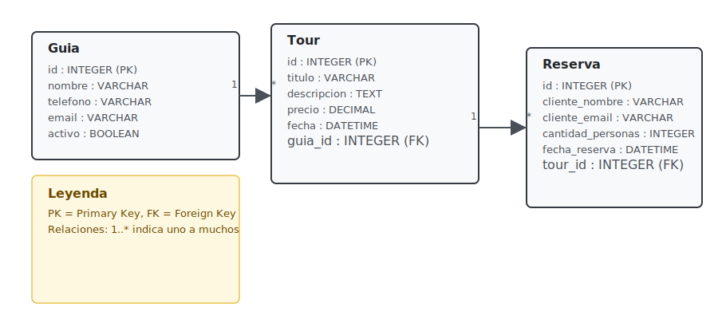

# Taller TypeORM - Integrante 2

Proyecto de práctica con TypeORM puro (Node.js + TypeScript). Contiene las entidades `Guia`, `Tour` y `Reserva` con servicios CRUD y un script de seeding `src/main.ts`.

## Instalación y ejecución

1. Instalar dependencias:

```powershell
npm install
```

2. Ejecutar seed (usando ts-node):

```powershell
npm run seed
```

3. Alternativamente, compilar y ejecutar en Node:

```powershell
npm run build
node dist/src/main.js
```

## Entidades y relaciones

Resumen de las entidades implementadas y sus campos principales:

- Guia
	- id: number (PK, autogenerada)
	- nombre: string
	- telefono: string
	- email?: string
	- activo: boolean (default true)
	- tours: Tour[] (OneToMany)

- Tour
	- id: number (PK, autogenerada)
	- titulo: string
	- descripcion: string (text)
	- precio: number (decimal)
	- fecha?: Date
	- guia: Guia (ManyToOne) — cada Tour tiene exactamente un Guia
	- reservas: Reserva[] (OneToMany)

- Reserva
	- id: number (PK, autogenerada)
	- clienteNombre: string
	- clienteEmail: string
	- cantidadPersonas: number
	- fechaReserva: Date
	- tour: Tour (ManyToOne)


Relaciones principales:
- Guia 1 --- * Tour
- Tour 1 --- * Reserva

Las entidades están en `src/entities` y usan los decoradores de TypeORM (`@Entity`, `@PrimaryGeneratedColumn`, `@Column`, `@ManyToOne`, `@OneToMany`).

## Diagrama Entidad-Relación (DER)

La siguiente imagen muestra el DER generado a partir del modelo de entidades. Si tu visor soporta SVG (por ejemplo la vista previa de VS Code o GitHub), la verás embebida a continuación:




## DataSource

La configuración se encuentra en `src/data-source.ts`. Usa SQLite (`database.sqlite`) y `synchronize: true` para crear automáticamente las tablas a partir de las entidades.

## Cómo generar el Diagrama Entidad-Relación (DER)

Opciones:

1. Usar una herramienta que importe la base de datos SQLite y genere el DER (por ejemplo DBeaver o DB Browser for SQLite). Abrir `database.sqlite` y usar la función de ER diagram.

2. Exportar el esquema SQL y usar un visualizador online (dbdiagram.io permite importar SQL o escribir la definición).

3. Usar herramientas/CLIs compatibles con TypeORM para generar metadatos y convertir a diagramas (requiere pasos adicionales). Si quieres, puedo generar un archivo SQL `schema.sql` desde la base de datos y luego crear una imagen DER y agregarla al repo.

## Notas y recomendaciones

- `synchronize: true` se usa para facilitar pruebas; en proyectos reales usar migraciones.
- Si quieres que genere el DER automáticamente, indícame si prefieres que use DBeaver/DB Browser (necesitas correrlo localmente) o que yo genere el SQL y una imagen y la agregue al repositorio.

## Archivos importantes

- `src/data-source.ts` - configuración del DataSource (sqlite)
- `src/entities` - entidades TypeORM (`Guia`, `Tour`, `Reserva`)
- `src/services` - servicios con métodos CRUD
- `src/main.ts` - script de seeding y pruebas

## Entregables adicionales

- `docs/schema.sql` - esquema SQL de las tablas (puedes importarlo en SQLite/DBeaver)
- `docs/der.svg` - imagen del Diagrama Entidad-Relación (embebida en este README)
- `docs/checklist.md` - mapeo de requisitos del taller al repositorio
- `docs/commit_log.txt` - ejemplo de commits por integrante (editar con tus propios commits)

## Preparar paquete para entrega

Incluí un script que crea un ZIP listo para entregar con los archivos principales del taller.

Para generar el ZIP desde PowerShell (en la carpeta del proyecto):

```powershell
.\scripts\package_submission.ps1
# genera `taller-typeorm-submission.zip` en la raíz del proyecto
```

Contenido incluido en el ZIP: `package.json`, `tsconfig.json`, `README.md`, `src/`, `docs/`.


### Generar PNG del DER

Incluí un archivo PlantUML `docs/der.puml` y un script PowerShell `scripts/generate_der_png.ps1` que descarga `docs/der.png` usando el servidor público de PlantUML.

Para generar la imagen en Windows PowerShell (desde la carpeta del proyecto):

```powershell
.\scripts\generate_der_png.ps1
```

Si prefieres generar offline con PlantUML local (recomendado para grandes cambios):

1. Descargar `plantuml.jar` desde https://plantuml.com/es/download
2. Ejecutar:

```powershell
java -jar plantuml.jar docs/der.puml -tpng -o docs
```

